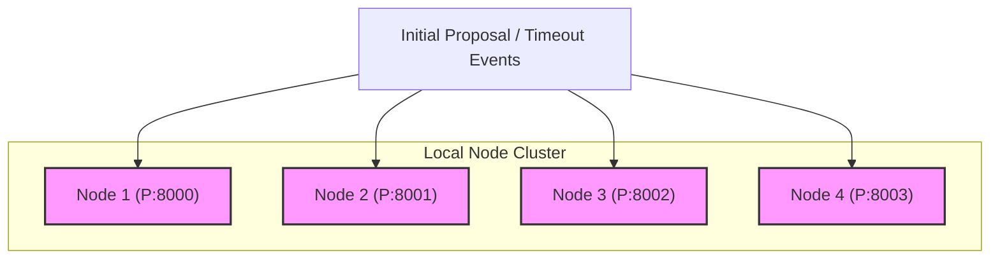
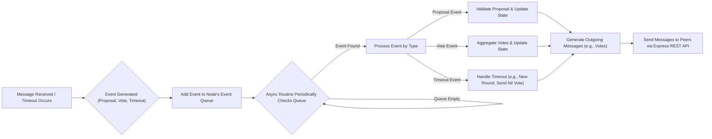

# LogicMint

A minimal TypeScript implementation of Practical Byzantine Fault Tolerance (pBFT),  
designed to simulate round-based consensus logic between local nodes.  
Built as a proof-of-concept to validate core consensus behavior in distributed systems.  

---

## Background

`LogicMint` was born from the need to integrate pBFT consensus into a legacy PHP blockchain aiming for public chain capabilities. Given the scarcity of PHP-based pBFT resources, this TypeScript project served as a rapid proof-of-concept.

Its core purpose was to quickly validate fundamental pBFT consensus logic and message flow, drawing inspiration from Tendermint, before a more complex PHP implementation was undertaken. Thus, it strictly simulates the essential round-based mechanics.

---

## 🔍 Features

- Pure pBFT round-based consensus logic
- Simulated peer nodes (4 local nodes on ports 8000-8003) communicating locally via Express.js REST APIs
- Tendermint-style PROPOSE, PREVOTE, PRECOMMIT message flow
- Asynchronous event processing loop for handling consensus messages and timeouts

---

## ⚙️ Architecture Overview (How it Works)

`LogicMint` simulates a pBFT-like consensus mechanism across multiple local nodes. Here's a brief overview of its architecture:

1.  **Local Node Cluster:** Upon execution, the system launches four distinct local nodes, each operating on a separate port (8000 through 8003).
2.  **Communication via REST API:** Nodes communicate with each other by sending and receiving consensus messages (like Propose, Prevote, Precommit) via Express.js-based REST API endpoints.
3.  **Event-Driven Processing:** Each node maintains its own **Event Queue**. Key consensus events such as:
    * `proposal` (when a new proposal is received or made)
    * `vote` (when a vote message is received)
    * `timeout` (when a consensus round takes too long)
    are added to this queue either upon message exchange or when a timeout condition is met.
4.  **Asynchronous Event Loop:** A dedicated asynchronous routine runs continuously within each node. This routine periodically monitors the Event Queue, dequeues events, and processes them according to the pBFT logic (e.g., updating the node's state, broadcasting new messages).

This event-driven, asynchronous model allows for a more realistic simulation of how nodes in a distributed consensus system might operate independently while reacting to messages and time-based conditions.

### Visual Representations

Below are diagrams illustrating the overall node structure and the event processing flow within a node.

**1. Node Cluster and Communication:**

This diagram shows the basic setup of the simulated nodes and how initial events can be triggered for them.


**Note:** The diagram above illustrates the initial triggering of events to each node. All four nodes (Node 1 to Node 4) are interconnected and communicate with each other via Express REST APIs to exchange consensus messages. These peer-to-peer connections are not explicitly drawn to maintain visual clarity.

**2. Single Node Event Processing Flow:**

This flowchart depicts the lifecycle of an event within a single node.


This flowchart shows how incoming messages or timeouts trigger events, which are queued and then processed asynchronously to drive the consensus logic.

---

## 📁 Project Structure

```
src/
├── classes/
│   ├── Server.ts        # Node simulation & communication
│   ├── Queue.ts         # Event queue processing
│   ├── State.ts         # Core consensus state logic
│   └── VoteSet.ts       # Vote tracking by round/step
├── interfaces/          # Typed message structures
├── types/               # Enum-like type declarations
└── index.ts             # Entrypoint
```

---

## 🚀 Getting Started

```bash
npm install
npm run build
npm start
```

This will compile the code and launch 4 simulated nodes that  
communicate locally and execute a full pBFT consensus round in the console.

---

## ⚠️ Disclaimer

This is a rapid prototype for learning and testing purposes.  
It does **not include networking, cryptographic signatures, validator weighting, or persistence**.  
Use it for education or as a base for further experimentation.

---

## 📚 References

- [Tendermint: Core BFT logic](https://github.com/tendermint/tendermint)
- pBFT original paper: [https://pmg.csail.mit.edu/papers/osdi99.pdf](https://pmg.csail.mit.edu/papers/osdi99.pdf)

---

## 🛠️ Status

✅ Prototype complete  
🧪 Internal use only  
🌱 Open to future expansion into full networking-enabled simulation
